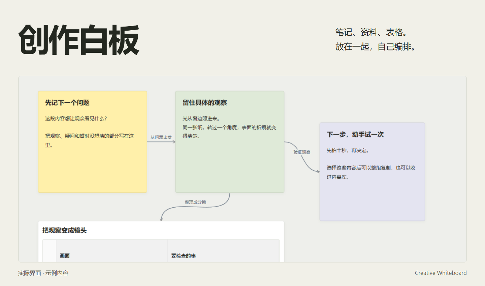

<h1>创作白板</h1>

把笔记、资料和表格摆在一起，拖动、连接，慢慢整理出自己的思路。



[开始使用](#开始使用) · [操作说明](docs/usage.md) · [查看完整界面](docs/overview.png) · [反馈问题](https://github.com/Yueyue673/creative-whiteboard/issues)

## 内容可以怎样摆放

**先写下来，再决定顺序。** 双击空白处写便签，直接编辑内容，新便签默认随内容增高；拖动四角后保留你指定的大小。把相关内容放在一起，用连线说明它们的关系。需要按行列整理时，可以换用表格；单元格里也能放多张图片、便签和音视频。长文字输入时，编辑区域会跟着光标滚动。

**资料放在想法旁边。** 图片、音视频、本地 HTML 和 JSON 可以放进白板查看。视频记住播放进度，支持的文档记住阅读位置，方便下次接着看。

**用过的内容，还能继续用。** 内容库支持嵌套文件夹。可以收起一组内容，也可以只取出其中一块。复制选中的内容，切换白板后直接粘贴；组内连线一起保留。

选中内容后，按住外框旁的点状拖动手柄，就能把副本放进表格、内容库文件夹或另一侧白板。大素材可以引用硬盘上的原文件；在不同位置使用同一份媒体，不需要再复制文件。

## 开始使用

需要 **Python 3.10 或更新版本**，以及 Chrome 或 Edge。无需安装 Python 第三方依赖。

```sh
git clone https://github.com/Yueyue673/creative-whiteboard.git
cd creative-whiteboard
python server.py
```

在浏览器打开 **http://127.0.0.1:18746/**。如果系统使用 `python3`，将最后一行改为 `python3 server.py`。

不使用 Git 的话，也可以从仓库的 **Code → Download ZIP** 下载，解压后运行。Windows 用户安装好 Python 后，可以右键运行 `启动白板.ps1`。使用过程中保留服务终端；关闭它会停止服务。

首次打开是空白板。可以从一条便签开始，也可以下载 [示例白板](examples/getting-started.json)，拖入画布后试着移动、编辑和连接。示例只是演示，不会预设你的项目分类。

## 最常用的几个操作

| 操作 | 方法 |
| --- | --- |
| 写内容、改内容 | 双击空白处新建；双击便签编辑 |
| 移动画布 | 按住右键拖动，也支持中键 |
| 缩放白板 | Ctrl＋滚轮，围绕鼠标位置缩放 |
| 调整便签大小 | 拖动四角的方形手柄 |
| 连线 | 选中内容，从边缘圆点拖向另一块内容；Esc 取消 |
| 跨白板复制 | Ctrl＋C，切换白板，Ctrl＋V |
| 撤销、搜索 | Ctrl＋Z、Ctrl＋K |
| 查看整张白板 | Shift＋1 |

粘贴时，鼠标在画布内就放在鼠标附近；在侧栏时放到画布中央。输入框中的复制粘贴仍用于编辑文字。

## 调整大小、同时打开几张白板

“更多 → 外观”提供深灰、纸白、蓝灰、暖砂、森林和墨紫六种配色，也可以自选画布、工具与侧栏、选中状态和新便签的颜色，并直接填写颜色值。画布可选纯色、点阵或细网格，底纹跟随移动和缩放。颜色、底纹、界面大小和侧栏宽度可命名保存为自己的预设，在当前浏览器随时切换；试调时可还原打开设置前的外观。已有便签的原文、颜色和尺寸保持不变。

Ctrl＋滚轮调整白板；HTML、JSON 的阅读比例由文档自己的比例按钮控制。选中内容后，底部的“字号”可以分别调整标题和正文，支持多选和撤销。长便签可展开编辑，返回时保持白板位置；表格可以直接拖动列边界调整宽度。

点击标签栏的“＋”打开其他白板，像浏览器一样切换。顶部的分栏图标可并排查看两张白板，拖动中间分隔线调整比例，双击恢复各半。标签可以拖动排序，也可以右键移到另一侧。左上角的侧栏图标打开全窗口共用的白板与内容库；从库中放入内容时，目标是刚刚操作的那一栏。跨标签 Ctrl＋C / Ctrl＋V 不需要额外点击画布。[查看标签与分栏操作](docs/usage.md#标签页与左右分栏)。

## 保存与 AI 参考

白板和内容库默认保存在本机 `data/` 文件夹。可直接备份该文件夹；引用在其他位置的媒体也需要单独备份。[查看文件位置与配置](docs/usage.md#文件位置与配置)。

快速保存保持安静；延迟、失败或文件冲突会明确提示。窄单元格内也能直接调整音视频进度，点击播放时间可以展开正常大小的控件。[查看播放与保存说明](docs/usage.md#资料阅读)。

白板打不开时，可以直接重试，内容库仍能使用。切换前会等当前修改保存；保存失败就保留原白板和文字，不会换到另一张。

点击顶部“参考”（独立白板页面为“AI”），选好背景，写下要查的问题，复制研究任务给自己的助手。AI 仅查资料和介绍已有参考体系，不生成创作文案、改写正文或改变设计。带原文链接的回复单独存为参考资料，由你核对、判断和使用。任务可包含位置关系、分组、表格、时间标记，以及真实的图片预览和布局快照。工具不调用模型，也不自动上传内容。[查看协作步骤](docs/ai-workflow.md) 与 [资料回复格式](docs/ai-proposals.md)。

音视频可以添加带名称和备注的时间标记，点击标记直接跳转，也可指定下次重开与重播的起点。未指定时仍接着上次播放。标记属于当前内容块；复制的内容有独立标记，媒体文件继续共用原文件。

白板支持 Shift＋2 放大选中内容、H/V 切换手形与选择工具、方向键微移、Shift 限制拖动方向和 Alt 拖出副本。选中多块内容，右键可对齐或调整间距。吸附、缩放速度与微移步长可在“外观 → 白板操作”调整。

拖动中按 Esc，可放弃这次移动、调整尺寸或复制；正常松手后可以撤销整个分组的移动。位置变化不会重建播放器和文字内容。

## 使用前了解

- 当前是本机工具。双开可以分别工作、跨窗口复制，但不支持多人实时协作；同一白板发生修改冲突时会提示。
- 音视频播放取决于浏览器支持的格式。阅读位置保存在当前浏览器里；外部网站和部分动态网页无法恢复。
- 历史记录可以帮助恢复误操作，仍建议独立备份。服务没有远程访问鉴权，请勿直接开放到公网。
- Windows 与 Chrome 是主要的界面验证环境。自动检查覆盖 Windows、Linux 的 Python 3.10 与 3.13；其他桌面环境仍需实际验证。

更多信息：[使用说明](docs/usage.md) · [参与开发](CONTRIBUTING.md) · [安全说明](SECURITY.md)

---

Creative Whiteboard is a local-first canvas for notes, media and tables. It runs with Python’s standard library and a browser. The interface and documentation are currently in Chinese.

[MIT License](LICENSE) applies to the application and included examples. The bundled html2canvas 1.4.1 renderer is also [MIT licensed](vendor/html2canvas.LICENSE). Imported media retains its original license.
