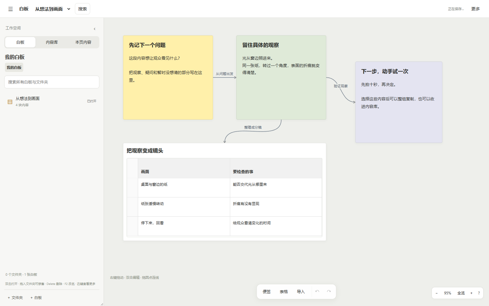

# 创作白板 · Creative Whiteboard

把文字、图片、视频和表格放在同一张白板上，自己整理、连接和编排。

A local-first whiteboard for notes, media, tables, and reusable content. Runs with Python’s standard library and a browser.



## 可以做什么

- **自由编排**：便签、分组、连线、四角调整大小；鼠标附近粘贴，整组复制时保留内部连线。
- **混合内容**：图片、音视频、HTML、JSON 与表格。表格单元格支持多张图片和行列移动。
- **积累和复用**：嵌套文件夹、多选分类；白板内容可以收进库，再整组或逐块取出。
- **接着上次工作**：记住媒体播放进度和文档阅读位置，提供历史记录与删除恢复。
- **两个窗口一起用**：在不同白板间复制内容；同一张白板同时修改时检查版本冲突。
- **让 AI 帮忙整理**：导出上下文，导入修改提案，再逐项决定是否采用。没有内置模型调用。

## 启动

需要 **Python 3.10 或更新版本**。无需安装 Python 第三方依赖。推荐使用近期版本的 Chrome 或 Edge。

```sh
git clone https://github.com/Yueyue673/creative-whiteboard.git
cd creative-whiteboard
python server.py
```

打开 **http://127.0.0.1:18746/**。有些系统使用 `python3 server.py`。

Windows 也可以在安装好 Python 后，右键运行 `启动白板.ps1`。按照终端提示打开浏览器；关闭服务终端可停止运行。

首次启动是一张空白板。想先试操作，可以把 [通用示例](examples/getting-started.json) 下载后拖到画布。

## 常用操作

| 想做什么 | 操作 |
| --- | --- |
| 写便签 | 双击空白处；双击便签编辑 |
| 移动画布 | 右键拖动，也支持中键 |
| 缩放白板 | Ctrl＋滚轮，以鼠标位置为中心 |
| 调整便签大小 | 拖便签四角的方形手柄 |
| 连接内容 | 拖边缘圆点；Esc 或在空白处松手取消 |
| 复制、剪切、粘贴 | Ctrl＋C / X / V，支持跨白板与窗口 |
| 撤销、搜索 | Ctrl＋Z；Ctrl＋K |
| 查看完整编排 | Shift＋1 |
| 调整工具栏和侧栏大小 | 更多 → 界面大小 |

文字输入框保留正常编辑快捷键。JSON、HTML 顶部的比例按钮调整文档阅读大小；Ctrl＋滚轮仍然缩放白板。

## 文件存在哪里

默认在项目下的 `data/` 保存个人数据，此目录已被 Git 忽略。

| 路径 | 内容 |
| --- | --- |
| `data/内容/` | 每张白板一个 JSON 文件 |
| `data/目录.json` | 白板文件夹关系 |
| `data/素材目录.json` | 内容库及文件引用 |
| `data/素材文件/` | 上传的文件 |
| `data/历史记录/`、`data/回收站/` | 恢复记录 |
| `data/AI待审核/` | 等待确认的 AI 提案 |

可以通过环境变量 `CREATIVE_BOARD_DATA_DIR` 指定数据目录；`CREATIVE_BOARD_PORT` 设置端口。浏览位置和界面偏好保存在浏览器本地存储，换浏览器不会自动同步。引用外部媒体时，备份白板 JSON 不等于备份媒体文件。

## 当前边界

这是持续迭代中的本机工具。Windows 与 Chromium 是主要验证环境；其他系统可运行 Python 服务，但桌面操作仍需更多测试。

- 仅监听本机地址，没有账号、远程访问鉴权或多人实时合并。不要通过端口转发直接开放到公网。
- 双开支持独立工作和冲突提示，不会自动合并两个人的修改。
- AI 接入采用导出、提案和审核流程，不会自动上传内容。
- 音视频格式能否播放取决于浏览器。外部网站和动态网页的内部状态不保证恢复。
- 历史记录与当前文件在同一数据目录中，不能替代独立备份。
- 当前前端保留了多轮迭代的覆盖式实现；模块化与更多交互回归测试仍待完善。

[使用说明](docs/usage.md) · [参与开发](CONTRIBUTING.md) · [安全说明](SECURITY.md)

## 测试

```sh
python -m unittest discover -s tests -v
```

测试使用临时数据目录，不读取个人工作区。GitHub Actions 会在 Windows、Linux 上检查 Python 3.10 与 3.13，并检查独立 JavaScript 文件语法。

## 许可证

[MIT](LICENSE)。许可证适用于本仓库程序和通用示例；导入的第三方媒体保留各自的权利与使用条件。
