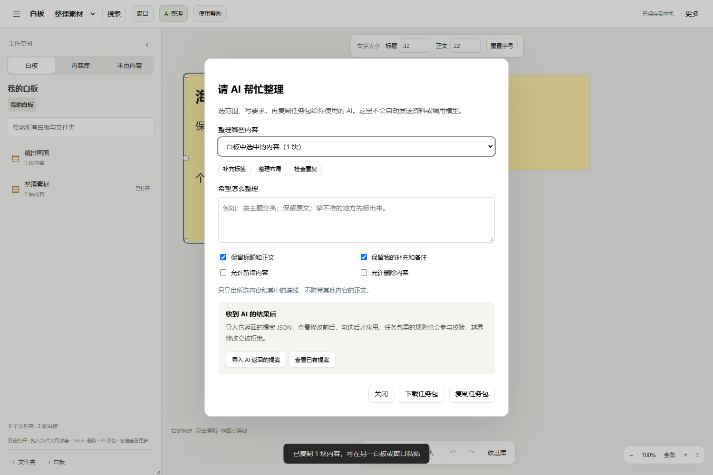

# 用 AI 查资料，自己完成创作

这个白板不内置模型，也不会自动把文件发出去。你选定背景、提出研究问题，再把材料交给自己使用的 AI。AI 的作用是寻找资料、介绍已有审美和内容组织体系；实际文字、判断和设计由你完成。

## 使用过程

1. 点击顶部 AI，选择提供的背景范围，写下要查的问题。可以从研究资料、内容体系参考或审美体系参考开始。
2. 展开“查看将提供的材料”，先准备并检查。只提供所选内容和内部连线，包含原文、备注、表格、时间标记及位置关系。选择内容库资料时，目录也只包含所选资料的存放位置和上级文件夹。
3. 复制研究任务。需要图片时下载材料包，把其中的图片一并上传给在线 AI。本地助手可以读取任务中的本地附件路径。只复制 JSON，不等于 AI 已看到图片。
4. 让 AI 按任务的 referenceRules 返回有来源的资料。粘回回复后，点击“查看并保存资料”。资料单独保存在本机的“参考资料”目录，不会插入白板或内容库。
5. 打开原文，检查信息与条件。由你决定是否采用，以及怎样写进作品。“已有资料”可以重新查看先前保存的来源。

资料可以介绍已有方法，但不能为你的作品创作标题、台词、正文、备注或具体设计方案。白板没有“应用 AI 修改”按钮，旧修改提案只能阅读，提交提案的接口也已关闭。这个限制约束产品里的任务与写回流程；它不代表工具能管住外部助手的所有文件权限，也不代表来源链接已经自动核验。

准备好任务后，如果修改了白板或内容库，下一次复制、下载会重新读取材料。未修改时会复用同一个任务，避免反复生成附件。

准备期间更换问题、背景范围或图片选项，旧材料会停止交付，提示重新准备。关闭后再打开研究窗口，也不会把上一份任务放进新窗口。已有预览过期时会明确提示。这样可以先查看材料，再决定是否交给自己的助手。

旧版任务仍可查看和下载，但读取与下载时统一使用现在的“只查资料”规则，原任务文件保留。下载包的说明和任务格式一致，回复只能保存为独立参考资料。

复制或下载之前，会重新确认已准备的图像附件。附件缺失、内容被替换或任务记录已不存在时，工具会按当前背景重新准备。预览加载失败和下载失败会留在研究窗口里提示，可以直接重试，问题和原文都保留。

图片旁显示原内容的标题，方便与白板或库中项目对照。共享图片会标明相关内容，不用辨认内部编号。

本地助手读取旧任务时，也会得到实际可用的图片及未包含的附件说明。旧材料包只装入核对过的附件，缺失部分在任务和说明中列明；不会把变化后的图片当成当时准备的画面。附件恢复后可重新读取，原任务文件不改。

## AI 能读取什么

文字资料附可读取的摘录，最多 12000 字符，并注明是否截断。图片可提供真实缩略图。可选的快照包含当前视窗和所选内容的整体布局；位置、尺寸、分组、表格内的位置另有结构化数据。相邻或对齐只是空间观察，不等于因果或作者指定的顺序。

快照由页面元素渲染，部分动态或原生控件可能有差异。嵌入 HTML 的实时画面没有采集，任务会明确说明。音频没有自动转写；视频只在已有画面可用时附当前静帧，不能代表完整内容。PDF、无法读取的原文件或超出附件容量的图像保留引用和缺口说明。

布局与图片附件保存在任务的独立目录，不复制原视频或音频。任务附件上限为 66 张、总计 12 MB；预览长边最多 1024 像素。需要辨认小字时仍应读取原图。

## 本地助手

准备任务后，使用 GET /api/ai/tasks 查看任务列表，GET /api/ai/tasks/任务编号 读取材料。任务里的 visuals.images 包含真正可读的 PNG 路径。GET /api/ai/tasks/任务编号/bundle 下载同一份 ZIP。助手把有出处的回复提交到 PUT /api/ai/references/新编号；格式见资料回复规范。原白板是只读背景，助手不应直接改写工作数据。
